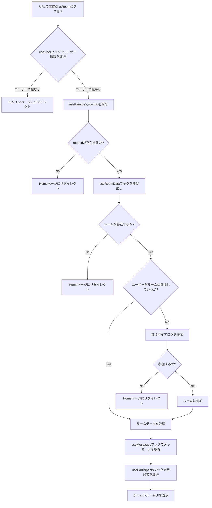

# ChatRoom直接アクセス時の詳細フロー

## 詳細なステップ説明

1. ユーザーがURLを直接入力してChatRoomにアクセスします。

2. useUserフックが呼び出され、ユーザー情報を取得します。
   - ユーザー情報がない場合、ログインページにリダイレクトされます。

3. useParamsフックを使用して、URLからroomIdを取得します。

4. roomIdの存在をチェックします。
   - roomIdが存在しない場合、Homeページにリダイレクトされます。

5. useRoomDataフックが呼び出され、以下の処理が行われます：
   a. ルームの存在をチェックします。
   b. ユーザーがルームに参加しているかチェックします。

6. ルームが存在しない場合、Homeページにリダイレクトされます。

7. ユーザーがルームに参加していない場合：
   a. 参加ダイアログが表示されます。
   b. ユーザーが参加を選択した場合、ルームに参加し、ルームデータを取得します。
   c. ユーザーが参加をキャンセルした場合、Homeページにリダイレクトされます。

8. ユーザーがルームに参加している場合：
   a. useMessagesフックを使用して、ルームのメッセージを取得します。
   b. useParticipantsフックを使用して、ルームの参加者リストを取得します。

9. 取得したデータを使用して、チャットルームのUIが表示されます。

このフローにより、ユーザーが直接URLを入力してChatRoomにアクセスした際の挙動が詳細に説明されています。各ステップでの条件分岐や、使用されているReactフックの役割が明確になっています。
