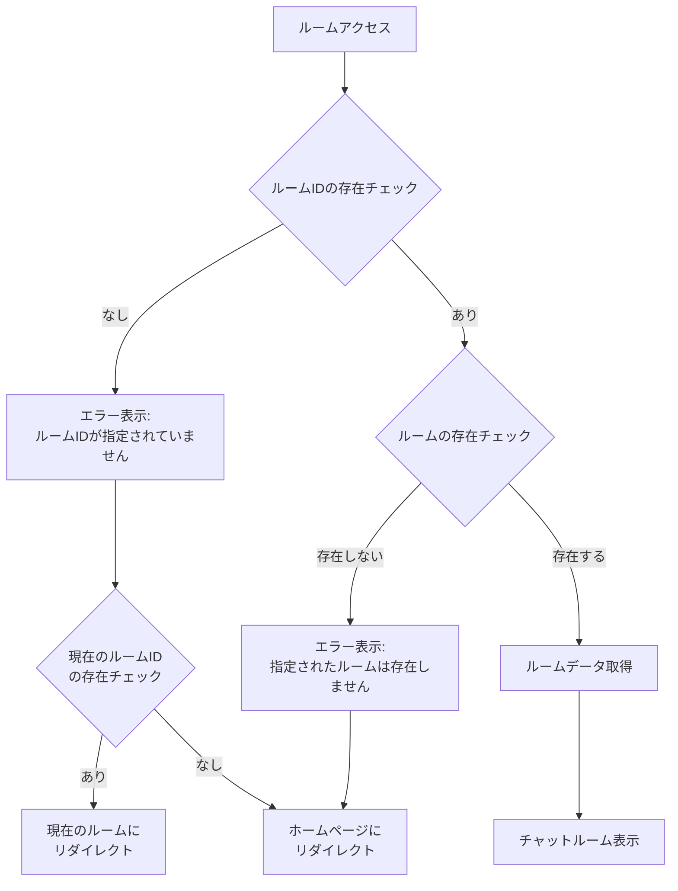

# ルームエラーハンドリング仕様

## 1. ホーム画面でのエラーハンドリング

### 1.1 ルームID入力時のバリデーション
- ルームIDが未入力の場合
  - エラーメッセージ: 「ルームIDを入力してください」
  - 動作: ルーム参加処理を中止
- 存在しないルームIDが入力された場合
  - エラーメッセージ: 「指定されたルームが存在しません」
  - 動作: ルーム参加処理を中止

### 1.2 エラーメッセージの表示
- 表示位置: 入力フィールドの下部
- 表示スタイル: 赤色テキスト
- 表示タイミング: エラー発生時に即時表示

## 2. チャットルーム直接アクセス時のエラーハンドリング

### 2.1 ルームID不在時の処理
- エラーメッセージ: 「ルームIDが指定されていません」
- 動作:
  1. エラーメッセージを表示
  2. 2秒後に自動的にホームページにリダイレクト
  3. 現在のルームIDが存在する場合は、そのルームにリダイレクト

### 2.2 存在しないルームへのアクセス時の処理
- エラーメッセージ: 「指定されたルームは存在しません」
- 動作:
  1. エラーメッセージを表示
  2. 2秒後に自動的にホームページにリダイレクト

### 2.3 エラー画面のデザイン
```
+------------------------+
|        エラー         |
+------------------------+
|   [エラーメッセージ]  |
|                       |
| ホームページに戻ります |
+------------------------+
```

- 背景色: #FFF8E1（アプリ共通の背景色）
- エラーメッセージ色: 赤色（#EF4444）
- サブテキスト色: グレー（#6B7280）

## 3. フローチャート



## 4. エラーメッセージ一覧

| エラーケース | メッセージ | 表示時間 | リダイレクト先 |
|------------|-----------|----------|--------------|
| ルームID未入力 | ルームIDを入力してください | 常時表示 | なし |
| 存在しないルームID | 指定されたルームが存在しません | 常時表示 | なし |
| URL直接アクセス時のルームID不在 | ルームIDが指定されていません | 2秒 | ホーム/現在のルーム |
| URL直接アクセス時の存在しないルーム | 指定されたルームは存在しません | 2秒 | ホーム |
